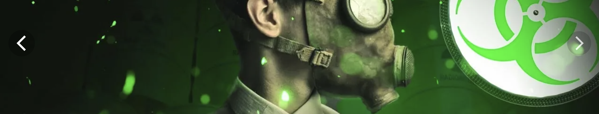

# nlp_project_streamlit_app

# Natural Language Processing Project

## Чтобы воспользоваться нашим приложением, перейдите по ссылке [Streamlit](https://huggingface.co/spaces/AnastasiaMozhayskaya/nlp_lstm_project)

### Команда: [Тигран](https://github.com/Solar-Iz), [Алексей](https://github.com/Alex-Dolgikh), Анастасия

**Проект:** Классификация отзывов на фильм 📽️ Оценка степени токсичности пользовательского сообщения 🌶️

## Две части.

### 1. Необходимо построить модель классификации введенного пользователем киноотзыва. Результаты предсказаний класса вывести тремя моделями.
##### Задача по моделям:
* Классический ML-алгоритм, обученный на BagOfWords/TF-IDF представлении
* RNN или LSTM модель (предпочтительно использовать вариант с attention)
* BERT

### 2. Оценка степени токсичности пользовательского сообщения
#####  Задачи:
* Решить с помощью предобученной модели [rubert-tiny-toxicity](https://huggingface.co/cointegrated/rubert-tiny-toxicity), доработанной для классификации токсичности и неуместности коротких неофициальных текстов на русском языке, таких как комментарии в социальных сетях.
